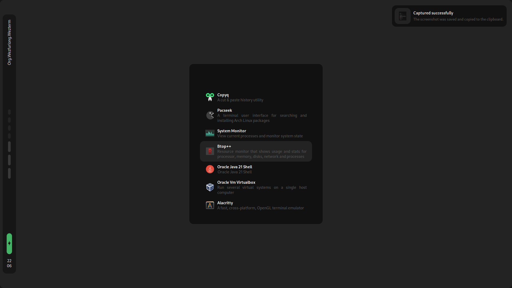
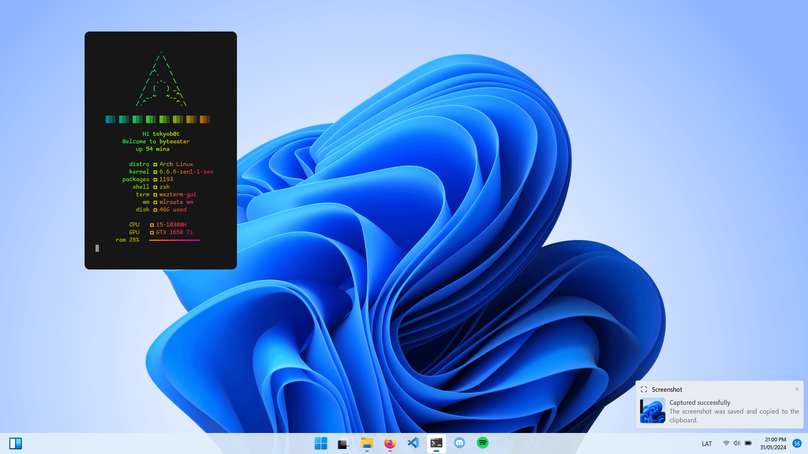
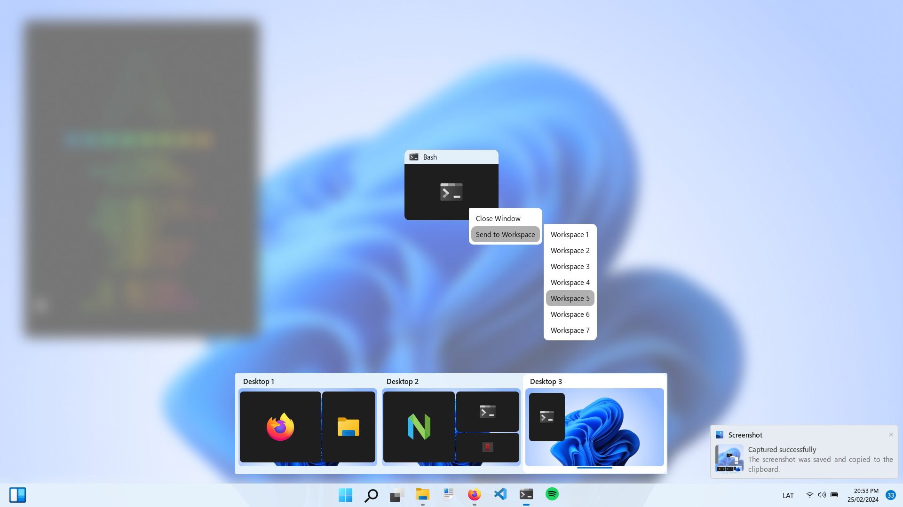
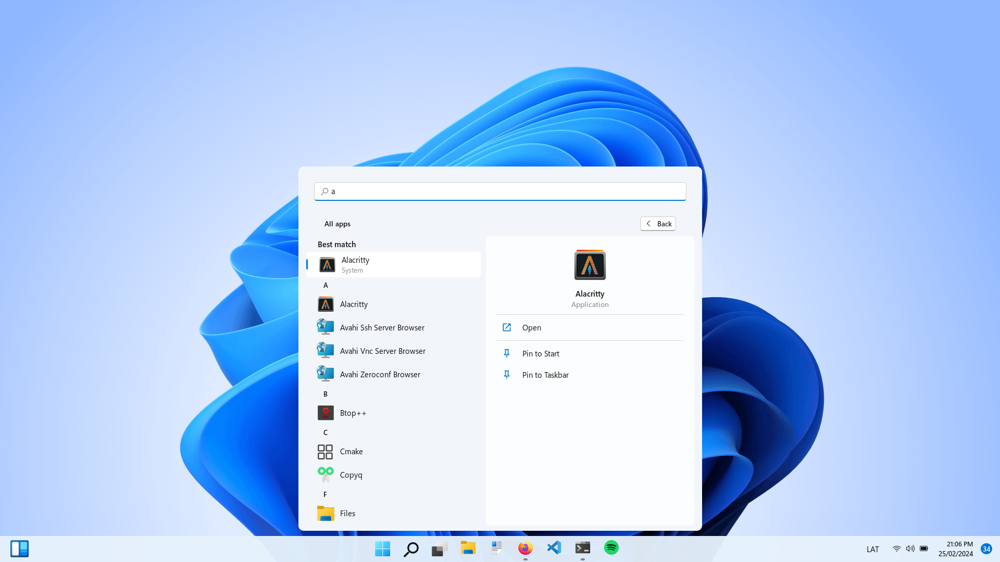

## PotatoWidgets

#### Wiki Under construction

#### PotatoWidgets is a Python library or framework designed to simplify interaction with Python and GTK. It focuses on being simple yet powerful, drawing inspiration from AGS and EWW. The syntax is designed to be declarative, providing an intuitive way to define GTK widgets

### Syntax

```py
#!/usr/bin/python

import subprocess

from datetime import datetime

from PotatoWidgets import PotatoLoop, Variable, Widget


if __name__ == "__main__":

    time = Variable.Poll(interval=1000, callback=datetime.now)

    MyFirstWindow = Widget.Window(
        at={"top": "20px",
            "left": "20",
            "right": 20},       # You can use any
        size=[0, "5%"],      # even %
        position="left top right",
        children=Widget.Box(
            classname="TESTBOX",
            children=[
                Widget.Label("Start"),
                Widget.Label(
                    time,
                    # Horizontal align
                    halign="center",
                    # Horizontal expand
                    hexpand=True),
                Widget.Box(
                    orientation="v",
                    # Vertical align
                    valign="center",
                    children=[
                        Widget.Label("Top"),
                        Widget.Label("Bottom")
                    ]
                ),
            ],
        ),
    )

    MyFirstWindow.open()
    PotatoLoop()
```


#### Installation

```bash
pip install git+https://github.com/T0kyoB0y/PotatoWidgets.git

```

##### ToDo

* Add More Services
  * [X] Applications
  * [X] Battery
  * [X] Notifications
  * [ ] Network
  * [ ] Bluetooth
  * [ ] Media
  * [ ] Brightness
  * [ ] Volume
  * [ ] Tray
  * [ ] What more?
  
* Add Dynamic variables
  * [X] Poll      - Timeout + Callback
  * [X] Variable - GObject Variable that notifies when it's value changes
  * [X] Listener  - Callback then await for changes - *Beta*

* Add more widgets
  * [X] Label
  * [X] Button
  * [X] ToggleButton
  * [X] Box
  * [X] CheckBox
  * [X] EventBox
  * [X] Revealer
  * [X] ToggleButton
  * [X] CenterBox
  * [X] Image
  * [X] Icon
  * [X] Scroll
  * [ ] Potato

* [X] Use GObject to detect dynamic variables in Widgets Props to update Widgets
* [X] Add a CLI utility(?
* [ ] Help x.x

#### My Current Setup

##### BSPWM
  

##### Hyprland




